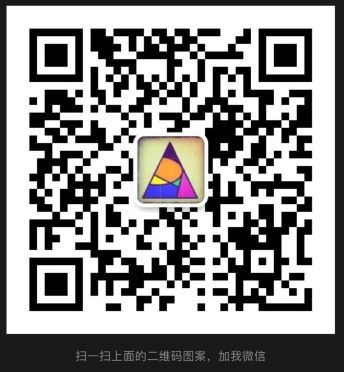

# 密码生成管理器
这是一个uniapp小程序，后端使用unicloud，可以编译成各个终端应用。具体参考uniapp介绍。

### 功能列表：
- 根据选择的密码元素生成随机密码，提示密码强度。可指定密码长度、数字、大写字母、小写字母、特殊字符、自定义特殊字符
- 无需登录，自动根据小程序openid 注册账号，不保存也不需要设置登录密码
- 前端生成主密码，完全前端JS AES-256 加密，加密后密文传输给后端，后端不保存密钥也获取不到
- 可通过生成的二维码或保存的密钥恢复主密码
- 打开小程序自动进入锁屏状态，需要输入锁屏密码
- 最最重要：程序完全开源，微信小程序使用方便，且保证保存账号密码安全 不会被管理员或者黑客破解

最终微信小程序效果：

本人全栈，主做后端，该小程序主要是为了保存自己常用密码开发。

有需求或者疑问可以加微信。麻烦帅哥美女顺手给个star 

